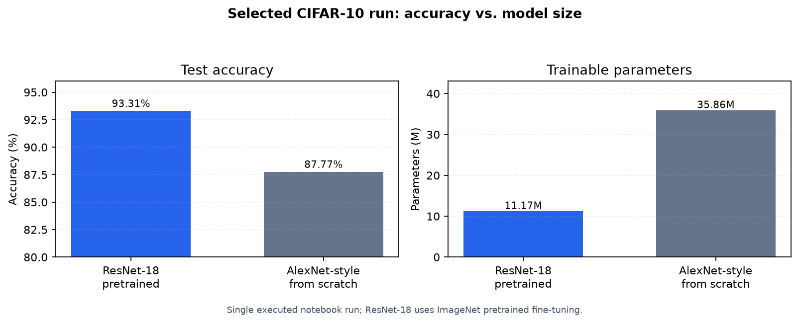

# CNN CIFAR-10 Classification

[](https://github.com/NAMEisNOTvailable/cnn-cifar10-classification/actions/workflows/smoke.yml)


PyTorch image-classification portfolio project comparing an ImageNet-pretrained ResNet-18 fine-tuned on CIFAR-10 against an AlexNet-style CNN trained from scratch.

## Project Snapshot

| Area | Summary |
| --- | --- |
| Task | CIFAR-10 image classification |
| Models | ImageNet-pretrained ResNet-18 fine-tuning and AlexNet-style CNN from scratch |
| Selected run | ResNet-18 reached 93.31% test accuracy in a single executed notebook run |
| Comparison point | Accuracy, model size, training behaviour, confusion matrix, and class-level errors |
| Main artefacts | [`notebooks/cnn_cifar10_classification.ipynb`](notebooks/cnn_cifar10_classification.ipynb), [`src/cnn_cifar10_classification`](src/cnn_cifar10_classification), [`results`](results), [`docs/portfolio_summary.md`](docs/portfolio_summary.md) |



## What This Demonstrates

- Built and trained deep-learning image classifiers on CIFAR-10 with PyTorch.
- Compared ImageNet-pretrained ResNet-18 fine-tuning against a larger AlexNet-style baseline trained from scratch.
- Used data augmentation, regularisation, and learning-rate scheduling.
- Evaluated model behaviour with accuracy, loss curves, confusion matrices, and class-level diagnostics.
- Reported the selected-run performance and parameter-count tradeoff for the ResNet-18 and AlexNet-style models.

## Results Summary

The committed notebook contains one executed run. These numbers are a portfolio snapshot for the selected train/validation/test split.

| Model | Test Accuracy | Approx. Parameters | Notes |
| --- | ---: | ---: | --- |
| ResNet-18 | 93.31% | 11.17M | ImageNet-pretrained model fine-tuned on CIFAR-10 |
| AlexNet-style CNN | 87.77% | 35.86M | Trained from scratch |

Machine-readable selected-run metrics are saved in [`results/selected_run_summary.json`](results/selected_run_summary.json) and [`results/model_comparison.csv`](results/model_comparison.csv).

The script workflow uses a deterministic train/validation split seed and keeps validation/test transforms deterministic. Training augmentation is applied only to the training subset.

## Project Notes

| What to inspect | Where |
| --- | --- |
| Executed notebook with training logs, confusion matrices, reports, and plots | [`notebooks/cnn_cifar10_classification.ipynb`](notebooks/cnn_cifar10_classification.ipynb) |
| Reusable training and evaluation workflow | [`src/cnn_cifar10_classification/experiment.py`](src/cnn_cifar10_classification/experiment.py) |
| Model definitions | [`src/cnn_cifar10_classification/models.py`](src/cnn_cifar10_classification/models.py) |
| Reproducibility and smoke-test coverage | [`tests`](tests), [`.github/workflows/smoke.yml`](.github/workflows/smoke.yml) |
| Portfolio positioning and caveats | [`docs/portfolio_summary.md`](docs/portfolio_summary.md) |

## Repository Structure

```text
assets/     Generated result chart for GitHub display
docs/       Portfolio notes and modelling caveats
notebooks/   Executed experiment notebook
results/     Selected-run summary files
scripts/     Command-line entry point
src/         Reusable dataset, model, training, and evaluation code
tests/       Pytest coverage for split logic, transforms, models, and quick runs
README.md    Portfolio overview and result summary
```

## Environment

Use Python 3.10 or 3.11. The notebook metadata records Python 3.10.0, and `.python-version` pins that version for local tools that support it.

```bash
python -m pip install --upgrade pip
pip install -e ".[dev,notebook]"
```

The legacy requirements wrapper is still available:

```bash
pip install -r requirements.txt
```

## Running

Run a fast smoke experiment without downloading CIFAR-10 or ImageNet weights:

```bash
cnn-cifar10-classification --quick --epochs 1 --batch-size 8 --num-workers 0 --no-checkpoints --output-dir results/smoke
```

Run the full CIFAR-10 comparison:

```bash
cnn-cifar10-classification --epochs 50 --output-dir results/full
```

The full run downloads CIFAR-10 and the ResNet-18 ImageNet weights unless `--no-pretrained-resnet` is supplied. A GPU is recommended.

Open the notebook:

```bash
jupyter notebook notebooks/cnn_cifar10_classification.ipynb
```

Run tests:

```bash
pytest
```

Regenerate the README result chart:

```bash
python scripts/generate_result_assets.py
```

## Skills Shown

- CNN model training and evaluation
- PyTorch deep-learning workflow
- Data augmentation and regularisation
- Model comparison and diagnostic reporting
- Clear technical communication for experimental results

## Limitations

- Results come from one executed train/validation/test split.
- The ResNet-18 result is a fine-tuning result using ImageNet-pretrained weights.
- The repository includes smoke tests and a quick run; full 50-epoch CIFAR-10 training remains a local/GPU workflow.

## License and Data

Original notebook code and documentation are licensed under the MIT License. CIFAR-10 is an external dataset and is not owned or relicensed by this repository; follow the original dataset terms when downloading or reusing it.

## Status

Academic portfolio project. The repository is organised around a result snapshot, a fast smoke check, and the full executed notebook.
